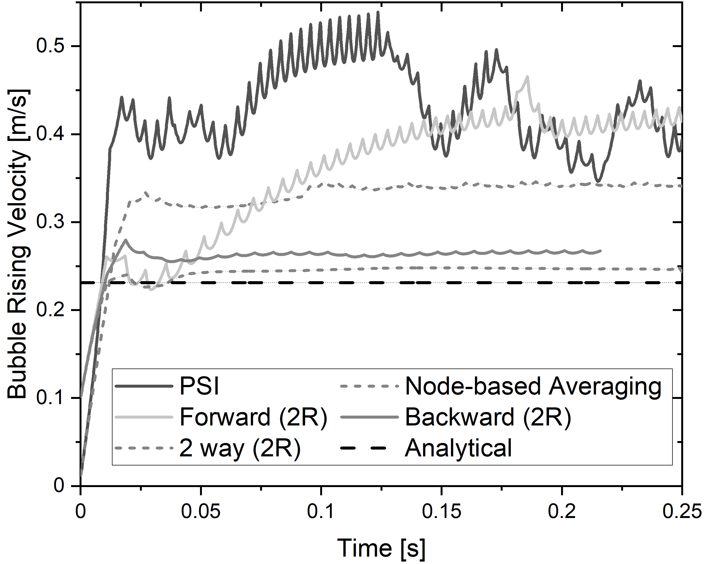
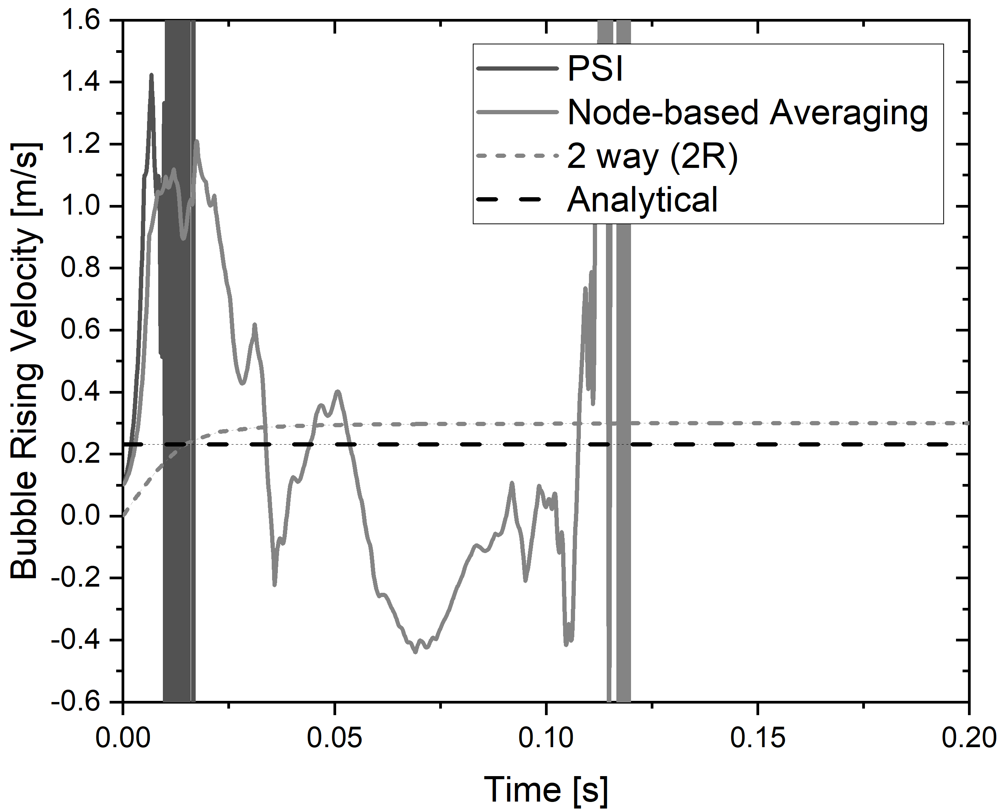

# DPM-Euler coupling for Ansys Fluent

Lagrange Particle Tracking (LPT) is commonly implemented with the particle source in a cell method by Clift et al. (PSI). This method was originally developed for sprays, thus, is based on the assumption that the particle is small compared to the Eulerian grid. This assumption is violated for larger particles like bubbles, especially on fine Eulerian grids such as those for LES simulations.

In those situations, momentum coupling with a single cell causes unphysical results like pseudo-turbulence (particle velocity fluctuations then the particle crosses a cell face) and an overestimate of both, the fluid and particle velocity (see figure below). Finally, it causes divergence. 

  

 
 Comparison between regular PSI model, Fluent node-based averaging and DPM-Euler coupling for a 6 mm and a 20 mm bubble on a 2 mm Eulerian grid 

 This user defined function (UDF) ensemble for unstructured hexahedral grid in Ansys Fluent makes LPT fully independent of the Eulerian grid. In forward coupling, the liquid velocities, velocity gradients and pressure gradients computed on the continuous phase’s control volumes are interpolated to the discrete bubble location and are used for the force balance in the Lagrangian reference frame. In backward coupling, the forces at the bubble’s centroid are mapped back wo the Eulerian grid nodes for the exchange source term in the Navier-Stokes equation. <i>The UDF enables different coupling schemes, selectable with the global variable COUPLING_SCHEME.</i> 

For coupling, a influencing sphere around the Lagrange particle is defined and all Eulerian cells within this influencing sphere has to be identified. As Fluent employes unstructured grids, a face loop cascade is employed for this. The Eulerian fluid properties are mapped to the Lagrange particle by the Deen mapping polynom and the particle's momentum is distributed back by the same approach. Different drag and lift closures can be chosen.

 
 

Coupling Schemes: (a) Forward (b) Backward coupling 

 
 <b>Available drag coefficient models</b>
 -Tomiyama drag correlation for pure systems
 -Tomiyama drag correlation for slightly contamined systems
 -Tomiyama drag correlation for fully contamined systems
 -Bozzano drag correlation
 -Dijkhuizen drag correlation
 <i>Choose the model by setting the DRAG_FLAG</i>

<b>Available lift coefficient models</b>
 -No lift force
 -Tomiyama lift correlation
 -Ziegenheim lift correlation
 -Constant lift coefficient 0.5
 <i>Choose the model by setting the LIFT_FLAG</i>

The UDF was tested on Fluent 2019 R3
