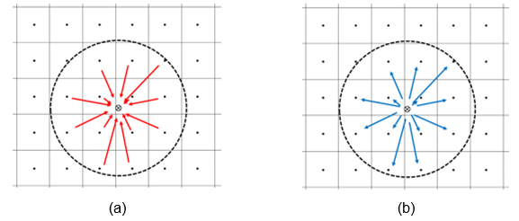

# DPM-Euler coupling for Ansys Fluent

  

<b>Available drag coefficient models</b>
  -Tomiyama drag correlation for pure systems
 -Tomiyama drag correlation for slightly contamined systems
 -Tomiyama drag correlation for fully contamined systems
 -Bozzano drag correlation
 -Dijkhuizen drag correlation

<i>Choose the model by setting the DRAG_FLAG</i>

<u>Available lift coefficient models</u>
-No lift force
-Tomiyama lift correlation
-Ziegenheim lift correlation
-Const lift coefficient 0.5
<i>Choose the model by setting the LIFT_FLAG</i>
